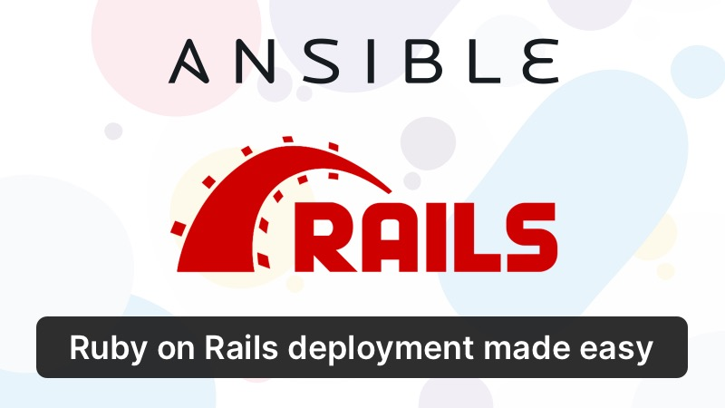

<h1 align="center">Ansible Rails</h1>
<p align="center">
    
<p>


Ansible Rails is meant to be a starting point for developing and deploying Ruby on Rails applications using Ansible. It uses Vagrant to provision a development environment. [Ansistrano](https://github.com/ansistrano/deploy) is used for deploying our code to staging and production environments.

While this is meant to work out of the box, you can tweak the files in the `roles` directory in order to satisfy your project-specific requirements. 

---

### What does this do?
* Configure our server with some sensible defaults
* Install the following useful packages. See notes below for more details.
* Auto upgrade all installed packages (TODO)
* Create a new deployment user (called 'deploy') with passwordless login
* Prevent root login

* SSH hardening
    * Prevent password login
    * Change the default SSH port
    * Prevent root login
* Setup UFW firewall
* Setup Fail2ban
* Install Logrotate
* Setup Nginx with some sensible config (thanks to nginxconfig.io)
* Certbot (for Let's encrypt SSL certificates)
* Ruby (using Rbenv). 
    * Defaults to `2.6.6`. You can change it in the `app-vars.yml` file
    * [jemmaloc](https://github.com/jemalloc/jemalloc) is also installed and configured by default
    * [rbenv-vars](https://github.com/rbenv/rbenv-vars) is also installed by default
* Node.js 
    * Defaults to 12.x. You can change it in the `app-vars.yml` file.
* Yarn
* Redis (latest)
* Postgresql. 
    * Defaults to v12. You can specify the version that you need in the `app-vars.yml` file.
* Puma (with Systemd support for restarting automatically)
* Sidekiq (with Systemd support for restarting automatically)
* Ansistrano hooks for performing the following tasks - 
    * Installing all our gems
    * Precompiling assets
    * Migrating our database (using `run_once`)

---

### Getting started
Here are the steps that you need to follow in order to get up and running with Ansible Rails. 

#### Step 1. Installation

```
git clone https://github.com/EmailThis/ansible-rails ansible-rails
cd ansible-rails
```

#### Step 2. Configuration
Open `app-vars.yml` and change the following variables. Additionally, please review the `app-vars.yml` and see if there is anything else that you would like to modify (e.g.: install some other packages, change ruby, node or postgresql versions etc.)

```
app_name:           YOUR_APP_NAME   // Replace with name of your app
app_git_repo:       "YOUR_GIT_REPO" // e.g.: github.com/EmailThis/et
app_git_branch:     "master"        // branch that you want to deploy (e.g: 'production')

postgresql_db_user:     "{{ deploy_user }}_postgresql_user"
postgresql_db_password: "{{ vault_postgresql_db_password }}" # from vault (see next section)
postgresql_db_name:     "{{ app_name }}_production"

nginx_https_enabled: false # change to true if you wish to install SSL certificate 
```


#### Step 3. Storing sensitive information
Create a new `vault` file to store sensitive information
```
ansible-vault create group_vars/all/vault.yml
```

Add the following information to this new vault file
```
vault_postgresql_db_password: "XXXXX_SUPER_SECURE_PASS_XXXXX"
vault_rails_master_key: "XXXXX_MASTER_KEY_FOR_RAILS_XXXXX"
```

#### Step 4. Deploy

Now that we have configured everything, lets see if everything is working locally. Run the following command -
```
vagrant up
```
Now open your browser and navigate to 192.168.50.2. You should see your Rails application.

If you don't wish to use Vagrant, clone this repo, change the hosts in the `inventories/development.ini` and then run the following command
```
ansible-playbook -i inventories/development.ini provision.yml
```

To deploy this app to your production server, create another file inside `inventories` directory with the following contents. For this, you would need a VPS. I've used [DigitalOcean](https://m.do.co/c/031c76b9c838) and [Vultr](https://www.vultr.com/?ref=8597223) in production for my apps and both these services are top-notch.
```
[web]
192.168.50.2 # replace with IP address of your server.

[all:vars]
ansible_ssh_user=deployer
ansible_python_interpreter=/usr/bin/python3
```

---

### Additional Configuration

#####  Installing additional packages

By default, the following packages are installed. You can add/remove packages to this list by changing the `required_package` variable in `app-vars.yml`
```
    - curl
    - ufw
    - fail2ban
    - git-core
    - apt-transport-https
    - ca-certificates
    - software-properties-common
    - python3-pip
    - virtualenv
    - python3-setuptools
    - zlib1g-dev 
    - build-essential 
    - libssl-dev 
    - libreadline-dev 
    - libyaml-dev 
    - libxml2-dev 
    - libxslt1-dev 
    - libcurl4-openssl-dev
    - libffi-dev 
    - dirmngr 
    - gnupg
    - autoconf
    - bison
    - libreadline6-dev
    - libncurses5-dev
    - libgdbm5 
    - libgdbm-dev
    - libpq-dev # postgresql client
    - libjemalloc-dev # jemalloc
```

---

### Questions, comments, suggestions?
Please let me know if you run into any issues or if you have any questions. I'd be happy to help. I would also welcome any improvements/suggestions by way of pull requests.


Thanks,

Bharani

Maker @ [EmailThis.me](https://www.emailthis.me)
